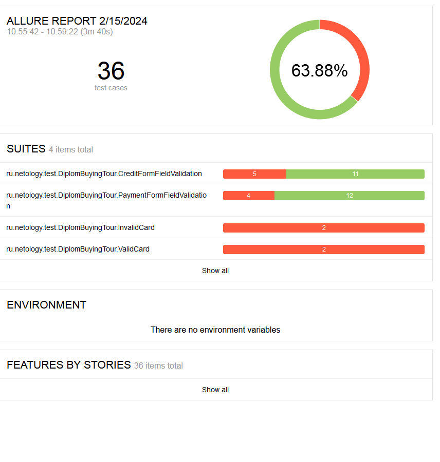

# Отчёт о проведенном тестировании

## Краткое описание
Автоматизированное тестирование произведено для функционала покупки тура "Путешествие дня" с помощью двух способов:
1. Обычная оплата по дебетовой карте
2. Уникальная технология: выдача кредита по данным банковской карты

## Количество тест-кейсов, % успешных/не успешных

Всего было проведено 36 автотестов. Общий процент успешных тестов равен 66,38%.

В результате прогона тестов были составлены 16 [issue](https://github.com/AsaulkaKsenia/DiplomBuyingTour/issues). 

## Общие рекомендации

- наличие атрибута test-id, присвоенного элементам страницы, значительно сократило время работы  

